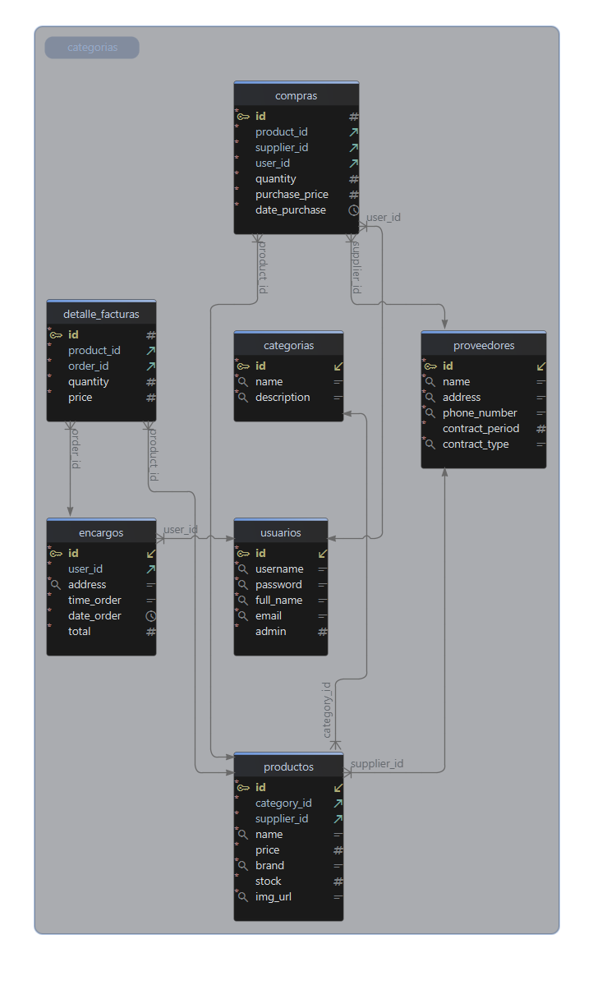

# Sports FastAPI PHP JS

Monorepo para una tienda deportiva dividida en tres proyectos:

- `backend_api/`: API en FastAPI para autenticación, productos, categorías, proveedores, compras, inventario, pedidos y facturas.
- `admin_portal/`: panel administrativo en PHP para gestionar la operación interna del sistema.
- `customer_store/`: tienda pública en JavaScript para clientes finales, con catálogo, carrito, checkout y autenticación.

## Estructura general

```text
backend_api/      API REST en FastAPI
admin_portal/     Portal administrativo en PHP
customer_store/    Frontend público de la tienda
```

## Requisitos

- Python 3.10+ para el backend.
- PHP 8+ para el portal administrativo.
- Node.js y npm para compilar los assets del portal admin.
- Un navegador moderno para el frontend público.

## Backend API

La API vive dentro de `backend_api/` y su punto de entrada está en `app/main.py`.

### Levantar el servidor

Desde la carpeta `backend_api/app/`:

```bash
uvicorn main:app --reload
```

### Funcionalidad principal

- Autenticación
- Usuarios
- Productos
- Categorías
- Proveedores
- Compras
- Inventario
- Encargos / pedidos
- Facturas

### CORS

La API está configurada para aceptar peticiones desde el frontend en desarrollo en:

- `http://127.0.0.1:5500`
- `http://localhost:5500`

### Endpoints principales

La API publica todas sus rutas bajo el prefijo `/api/v1`.

| Recurso | Ruta base | Uso |
| --- | --- | --- |
| Autenticación | `/api/v1` | Inicio de sesión y manejo de acceso |
| Usuarios | `/api/v1/users` | CRUD de usuarios |
| Productos | `/api/v1/products` | CRUD de productos |
| Categorías | `/api/v1/categories` | CRUD de categorías |
| Proveedores | `/api/v1/suppliers` | CRUD de proveedores |
| Compras | `/api/v1/purchases` | Registro y consulta de compras |
| Encargos | `/api/v1/orders` | Consulta y gestión de pedidos |
| Facturas | `/api/v1/invoices` | Generación y consulta de facturas |
| Inventario | `/api/v1/inventory` | Consulta y control de stock |

En particular, el módulo de productos expone operaciones estándar de creación, listado, consulta por id, actualización y eliminación.

### Clases y módulos principales

- `backend_api/app/main.py`: instancia de FastAPI y registro de routers.
- `backend_api/app/models/*.py`: modelos y esquemas Pydantic y SQLAlchemy por dominio.
- `backend_api/app/services/*.py`: lógica de negocio y acceso a datos.
- `backend_api/app/routers/v1/*.py`: definición de endpoints versionados.
- `backend_api/app/db/database.py`: configuración de base de datos y dependencias.

## Portal administrativo

El portal administrativo vive en `admin_portal/` y usa PHP con rutas definidas en `index.php`.

### Levantar el servidor

Desde la carpeta `admin_portal/`:

```bash
php -S localhost:8080
```

### Endpoints y rutas

El panel administrativo expone rutas web orientadas a la gestión interna.

| Ruta | Uso |
| --- | --- |
| `/login` | Inicio de sesión |
| `/logout` | Cierre de sesión |
| `/admin` | Panel principal |
| `/products` | Listado de productos |
| `/products/create` | Alta de productos |
| `/products/update` | Edición de productos |
| `/categories` | Listado de categorías |
| `/categories/create` | Alta de categorías |
| `/categories/update` | Edición de categorías |
| `/users` | Listado de usuarios |
| `/users/create` | Alta de usuarios |
| `/users/update` | Edición de usuarios |
| `/suppliers` | Listado de proveedores |
| `/suppliers/create` | Alta de proveedores |
| `/suppliers/update` | Edición de proveedores |
| `/purchases` | Listado de compras |
| `/purchases/create` | Registro de compras |
| `/inventory` | Consulta de inventario |
| `/orders` | Listado de pedidos |

### Clases y controladores principales

- `admin_portal/controllers/AuthController.php`: autenticación y cierre de sesión.
- `admin_portal/controllers/AdminController.php`: vista principal del panel.
- `admin_portal/controllers/ProductController.php`: CRUD de productos.
- `admin_portal/controllers/CategoryController.php`: CRUD de categorías.
- `admin_portal/controllers/UserController.php`: CRUD de usuarios.
- `admin_portal/controllers/SupplierController.php`: CRUD de proveedores.
- `admin_portal/controllers/PurchaseController.php`: compras y entradas de inventario.
- `admin_portal/controllers/InventoryController.php`: vista de inventario.
- `admin_portal/controllers/OrderController.php`: pedidos.
- `admin_portal/controllers/BaseController.php`: utilidades compartidas por controladores.
- `admin_portal/services/ApiClient.php`: cliente HTTP para consumir la API FastAPI.

## Tienda pública

La tienda pública vive en `customer_store/` y está compuesta por HTML, CSS y JavaScript modular.

### Cómo abrirla

Puedes servirla con un servidor estático local o abrir `customer_store/index.html` en tu navegador durante pruebas rápidas.

Para trabajar con la API sin problemas de CORS, conviene servirla en un puerto local compatible con `5500`.

### Rutas visibles

La tienda pública usa enrutamiento del lado del cliente para estas vistas:

| Ruta | Uso |
| --- | --- |
| `/` | Inicio |
| `/catalogo` | Catálogo de productos |
| `/carrito` | Carrito de compras |
| `/checkout` | Finalización de compra |
| `/login` | Inicio de sesión |
| `/registro` | Registro de usuario |

### Módulos principales

- `customer_store/index.html`: contenedor principal de la aplicación.
- `customer_store/js/router.js`: router del lado del cliente.
- `customer_store/js/pages/auth.js`: login y registro.
- `customer_store/js/pages/catalogo.js`: listado y filtrado de productos.
- `customer_store/js/pages/carrito.js`: lógica del carrito.
- `customer_store/js/pages/checkout.js`: cierre de compra.
- `customer_store/js/services/ApiService.js`: comunicación con la API.

## Documentación visual

Las imágenes almacenadas en `docs/` resumen la estructura y el modelo de datos del proyecto.

### Diagrama UML


### Modelo entidad-relación



## Flujo recomendado de arranque

1. Levanta la API en `backend_api/app/`.
2. Levanta el portal admin en `admin_portal/`.
3. Abre o sirve `customer_store/` en el navegador.

## Notas del proyecto

- El backend expone su API bajo el prefijo `/api/v1`.
- El portal admin organiza sus vistas en `views/` y sus controladores en `controllers/`.
- El frontend público carga sus módulos desde `customer_store/js/`.
